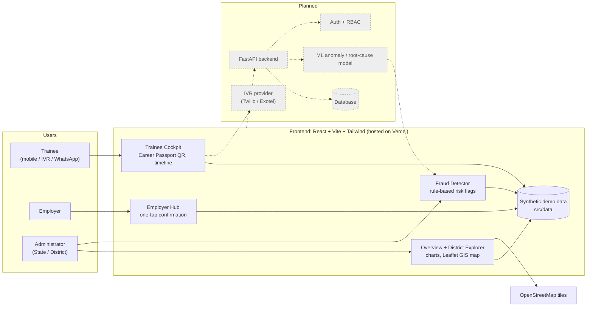
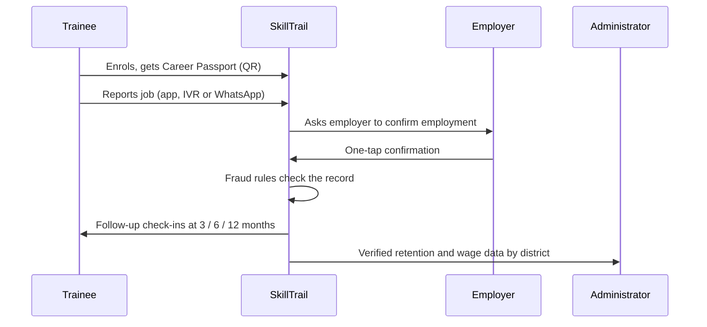

<div align="center">

# SkillTrail

**Track the journey. Verify the outcome.**

A longitudinal skilling-outcomes tracking and employment-verification platform for the Government of Maharashtra.

Smart India Hackathon 2026 · Problem Statement **PS 26135**

[**Live Demo**](https://skilltrail-ten.vercel.app) · [Features](#features) · [Getting Started](#getting-started) · [Roadmap](#roadmap)

<!-- Replace with a real screenshot: save it as docs/screenshots/overview.png -->
<!--  -->

</div>

---

## The Problem

Skilling programmes report how many people were *trained*, but rarely what happened to them afterwards. Once a trainee leaves the classroom, nobody reliably tracks:

- whether they got a job, and whether they are **still employed** after 3, 6 and 12 months
- what they actually earn compared with what was promised
- whether reported placements are **genuine or inflated**

Without this data, policymakers cannot tell which districts, trades or training partners actually work, and fake or unverified placements go unnoticed.

## Our Solution

SkillTrail follows a trainee from enrolment through employment and turns that journey into verified, district-level outcome data.

1. **Trainees** carry a digital *Career Passport* (QR-based) and can report status through a mobile-first app, or through IVR/WhatsApp if they have limited connectivity.
2. **Employers** confirm employment with a single tap, which creates a verified record.
3. **Administrators** see retention, wage and placement outcomes on a state and district dashboard, with a rule-based detector that flags suspicious placements.

## Features

| Module | Route | What it does |
| --- | --- | --- |
| **Overview** | `/` | State-level statistics, retention and wage charts, and a map preview |
| **Trainee Cockpit** | `/trainee` | Mobile-first view with Career Passport QR, journey timeline, and IVR/WhatsApp fallback |
| **Employer Hub** | `/employer` | One-tap employment confirmation for employers |
| **District Explorer** | `/districts` | Interactive Leaflet GIS map and sortable table covering 15 Maharashtra districts |
| **Fraud Detector** | `/fraud` | Rule-based risk flags for suspicious placement records |
| **Mobile Roadmap** | `/roadmap` | Phase 2 native mobile app plan with mockup screens |

Also included: light/dark mode, and a language toggle (UI stub, see [Known Limitations](#known-limitations)).

## Tech Stack

| Layer | Technology |
| --- | --- |
| Frontend | React, Vite, Tailwind CSS |
| Maps | Leaflet with OpenStreetMap tiles |
| Deployment | Vercel |
| Planned backend | FastAPI (see [Roadmap](#roadmap)) |

## Architecture

Solid lines are **built in this prototype**. Dashed lines and grey nodes are **planned** (see [Roadmap](#roadmap)).



### How a placement gets verified



## Getting Started

**Prerequisites:** Node.js 18 or later and npm.

```bash
# 1. Clone the repository
git clone https://github.com/Tabbu04/Skilltrail.git
cd Skilltrail

# 2. Install dependencies
npm install

# 3. Start the dev server
npm run dev
```

Open the local URL printed in the terminal (usually <http://localhost:5173>).

To create a production build:

```bash
npm run build
```

The output is written to `dist/`, ready for Vercel, Netlify or any static host.

## Project Structure

```
Skilltrail/
├── public/            # Static assets
├── src/
│   ├── data/          # Synthetic demo datasets (swap for real APIs later)
│   └── ...            # Pages, components and routing
├── index.html
├── tailwind.config.js
├── postcss.config.js
└── vite.config.js
```

## Data Notice

> All data in `src/data/` is **synthetic and for demonstration only**. District-level outcome numbers are illustrative and are **not** real government statistics. The district coordinates and map tiles are real.
>
> This is a hackathon prototype, not a production system. Do not enter real trainee personal data into it.

## Known Limitations

- The **language toggle** currently only changes the button label. A full i18n string table is needed for real multilingual support.
- The **Employer Hub** confirmations are stored in local state and do not persist.
- The **Fraud Detector** uses hand-written rules, not a trained model.
- There is **no authentication or role-based access control** yet.

## Roadmap

In priority order:

- [ ] Connect the Employer Hub to a FastAPI backend instead of local state
- [ ] Replace the synthetic `src/data/*.js` files with real API calls
- [ ] Add an ML root-cause and anomaly model (logistic regression or a small XGBoost) behind the Fraud Detector
- [ ] Integrate an IVR provider (Twilio or Exotel) for the "Request IVR call-back" flow
- [ ] Add authentication and role-based access control before handling real trainee data
- [ ] Build the native mobile app (Phase 2)
- [ ] Complete multilingual support
